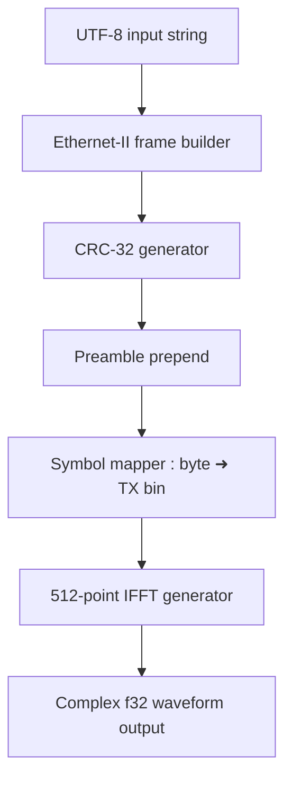
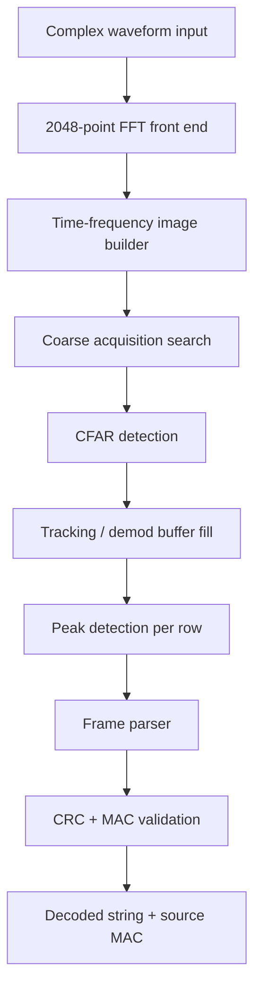

# FishNet Radio Modem v2 Specification

## 1. Overview

FishNet Radio Modem v2 is a narrowband, 256-ary FSK modem that transmits Ethernet-II-like frames over a complex baseband waveform. The modem is designed for coherent FFT-based reception and packet validation.

- Sample rate: `1 MHz`
- Modulation: `256-FSK`
- Symbol duration: `512 µs` (512 samples)
- Raw data rate: `15.625 kb/s`
- Output format: complex `f32` samples
- Transmitter IFFT size: `512`
- Receiver FFT size: `2048` with overlap for doppler detection

## 2. Physical layer parameters

- Symbol size: `512 samples` at `1 MHz`
- Transmitter FFT size: `512`
- Receiver FFT size: `2048`
- Valid transmitter tone bins:
  - low block: `8..135`
  - high block: `376..503`
- Receiver nominal valid bin positions:
  - low block: `32..540` with every 4th bin representing a transmitter symbol
  - high block: `1504..2012` with every 4th bin representing a transmitter symbol
- Total transmitted symbols: `256` mapped to the valid TX bins exactly
- Channel conversion span: `265625 Hz`

## 3. Frame format

Frames are built from a short modem header followed by an Ethernet-II-like body with MAC
addresses, payload, and CRC-32.

- Preamble: `8 bytes` with ASCII values `F i S h N e T :`
- Length header: `2 bytes`, little-endian body length, repeated `3` times
  for simple majority-vote forward error correction
- Destination MAC address: `6 bytes`
- Source MAC address: `6 bytes`
- Payload: UTF-8 string bytes
- CRC-32: covers destination MAC, source MAC, and payload

The length header describes the number of bytes after the repeated length sequence:
destination MAC, source MAC, payload, and CRC-32. No minimum payload length is
required. The receiver accepts the broadcast MAC address as a valid destination.

## 4. Transmitter design

### 4.1 Input processing

- Input is a UTF-8 string payload.
- The modem constructs the transmit frame as:
  - `Preamble (8 bytes)`
  - `Length header (2 bytes)` repeated `3` times
  - `Destination MAC (6 bytes)`
  - `Source MAC (6 bytes)`
  - `Payload bytes`
  - `CRC-32` computed over destination MAC, source MAC, and payload
- The repeated length header is not included in the CRC-32.

### 4.2 Symbol mapping

- Each byte is encoded into a single FSK symbol.
- A symbol value `0..255` maps to one active FFT bin in the valid bin set.
- Exactly one bin is hot per symbol; all others are zero.
- Mapping distribution:
  - symbol values `0..127` -> bins `8..135`
  - symbol values `128..255` -> bins `376..503`
  - This uses all 256 valid bins exactly.

### 4.3 Waveform generation

- For each symbol:
  1. Create a `512`-point complex frequency buffer.
  2. Set the selected transmitter bin to a constant complex amplitude.
  3. Zero all other bins.
  4. Perform a `512`-point inverse FFT.
  5. Output the resulting `512` complex `f32` samples for the symbol.

- The transmitter outputs a continuous stream of complex samples representing the concatenated symbols.

### 4.4 Transmitter block diagram

## 5. Receiver design

### 5.1 Stage 1: FFT front end

- Continuously ingest complex baseband samples.
- Compute overlapping `2048`-point FFTs to resolve doppler shifts and symbol-level bin offsets.
- Output complex spectrum buffers for each FFT window.

### 5.2 Stage 2: Coarse acquisition and tracking

- Build a time-frequency image from consecutive FFT rows.
- Discard unused bins in the middle of the spectrum: `541..1503`.
- Interpret each symbol as `4` FFT rows.
- Preamble length is `32` rows, with a search buffer depth of `36` rows.
- Receiver nominal symbol bins are spaced every 4 FFT bins in the `2048` grid:
  - low block: `32, 36, 40, ..., 540`
  - high block: `1504, 1508, 1512, ..., 2012`
- The receiver resolves a fine doppler shift by refining this nominal mapping after acquisition.

#### Search

- Correlate the received time-frequency image against the known preamble symbol sequence.
- Search frequency offset around the nominal RX bin positions so the transmitter 512-pt bin grid can be aligned with the 2048-pt receiver grid.
- Search timing offset over `±4` row shifts.
- Use complex conjugate multiplication and sum the real part for correlation.

#### Detect

- Apply CFAR detection to the correlation output.
- Maintain the average of the last `3200` non-detection rows using a boxcar integrator.
- Trigger on a peak-to-average ratio of `10`.
- When triggered, record the best delay and frequency offset.

#### Track

- After detection, switch to magnitude-based tracking.
- Compute magnitude-squared of the detected symbol bins.
- Store average energy per row.
- Append the valid column magnitudes into the demodulation buffer.
- Continue until the average column energy drops below `10%` of the recent average for `4` consecutive rows.
- Emit the demod buffer and return to search mode.

### 5.3 Stage 3: Demodulation and validation

- For each row in the demod buffer:
  - Identify the peak bin index among the valid bins.
  - Map the peak bin index back to a byte value `0..255`.
- Assemble the received bytes into a frame.
- Parse frame fields:
  - Preamble
  - Repeated length header
  - Destination MAC
  - Source MAC
  - Payload
  - CRC-32
- Majority-vote the three length header copies and use the decoded length to
  delimit the frame body.
- Validate CRC-32 over destination MAC, source MAC, and payload.
- Validate destination MAC against local unicast or broadcast address.
- If validation succeeds, output the payload string and source MAC address.

### 5.4 Receiver block diagram

## 6. MAC support and validation

- Destination MAC may be:
  - a specific unicast address
  - the broadcast address
- Frames with a destination MAC that does not match local unicast or broadcast are discarded.
- Only frames with valid CRC-32 are delivered.

## 7. Design assumptions

- The modem is coherent in Stage 1 and performs symbol synchronization in Stage 2.
- Frame validation is strict: incorrect CRC or wrong destination MAC means drop.
- The preamble and repeated length header are not part of the frame CRC.

## 8. Notes

- The transmitter uses exactly one active tone per symbol, so the link is FSK rather than OFDM.
- The valid bin mapping is symmetric: one contiguous block low and one symmetric block high.
- This document is the complete modem specification for the current design.
